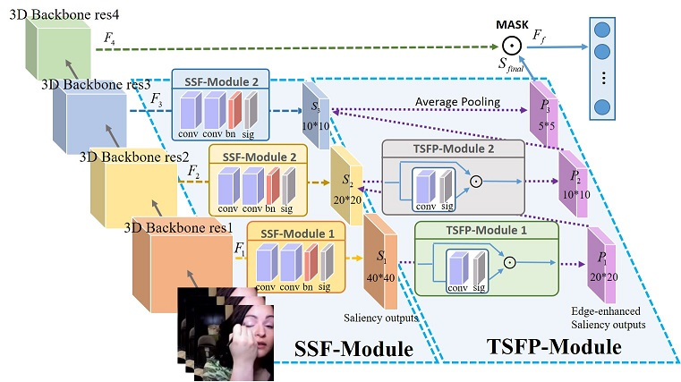

# SaliNet: Salient Spatio-Temporal Feature Mining Network for Video Classification

This is the official implementation of the "SaliNet: Salient Spatio-Temporal Feature Mining Network for Video Classification":

```BibTeX
@article{SaliNet,
title = {SaliNet: Salient Spatio-Temporal Feature Mining Network for Video Classification},
journal = {Knowledge-Based Systems},
author = {Xiaoxi Liu and Ju Liu and Lingchen Gu and Yafeng Li and Xiaojun Chang and Feiping Nie},
year = {2022}
}
```

Recently, 3D Convolutional Neural Networks (3D ConvNets) have been widely exploited for video comprehension and achieved
satisfying performance. However, the superior features are often drowned in numerous irrelevant information, which immensely
enhances the difficulty of video representation. To find a generic cost-efficient approach to balance the parameters and performance,
we present a novel salient feature mining network based on 3D ConvNets backbone in an end-to-end manner, termed as Salient
Spatio-temporal Feature Mining Network (SaliNet). Firstly, we extract the salient features of each 3D residual block by constructing
a multi-scale Salient Semantic Feature Mining Module (SSF-Module). Then, with the aim of preserving the salient features in
pooling operations, we establish a Two-branch Salient Feature Preserving Module (TSFP-Module). Besides, these above two
modules with proper loss function can collaborate in an “easy-to-concat” fashion for most 3D Resnet backbones to classify more
accurately albeit in the shallower network. Finally, we conduct experiments over three popular datasets: Kinetics-400, UCF101,
and HMDB51, where our SaliNet is competitive compared with the deeper 3D backbones or current state-of-the-art results.



## Installation

Please make sure your setup satisfies the following requirements:

## Requirements

Largely follows the original SlowFast repo requirements:
- Python >= 3.6
- fvcore==0.1.5.post20220512
- imageio==2.19.3
- iopath==0.1.9
- matplotlib==3.5.2
- mmaction==0.5.0
- mmcv==1.5.3
- moviepy==1.0.3
- numpy==1.19.2
- psutil==5.9.1
- scikit_learn==1.1.1
- simplejson==3.17.6
- torch==1.7.1
- torchvision==0.8.2
- tqdm==4.64.0

## Datasets

**1. Kinetics**

You can download Kinetics 400/600 datasets following the instructions provided by the cvdfundation repo: https://github.com/cvdfoundation/kinetics-dataset

**2. UCF101**

You can download the datasets from the authors webpage: https://www.crcv.ucf.edu/data/UCF101.php

**3. HMDB51**

You can download the datasets from the authors webpage: https://serre-lab.clps.brown.edu/resource/hmdb-a-large-human-motiondatabase

## Usage

### Training

```bash
python -m torch.distributed.launch --nproc_per_node=2 --master_port=5333 run_net.py \
  --cfg configs/Nonlocal_I3D_R50.yaml \
  DATA.PATH_TO_DATA_DIR path_to_your_dataset
```

### Evaluation

```bash
python -m torch.distributed.launch --nproc_per_node=2 --master_port=5333 run_net.py \
  --cfg configs/Nonlocal_I3D_R50.yaml \
  DATA.PATH_TO_DATA_DIR path_to_your_dataset \
  TEST.CHECKPOINT_FILE_PATH path_to_your_checkpoint \
  TRAIN.ENABLE False \
```

## Acknowledgements

This repo is built using components from [SlowFast](https://github.com/facebookresearch/SlowFast) and [timm](https://github.com/rwightman/pytorch-image-models)

